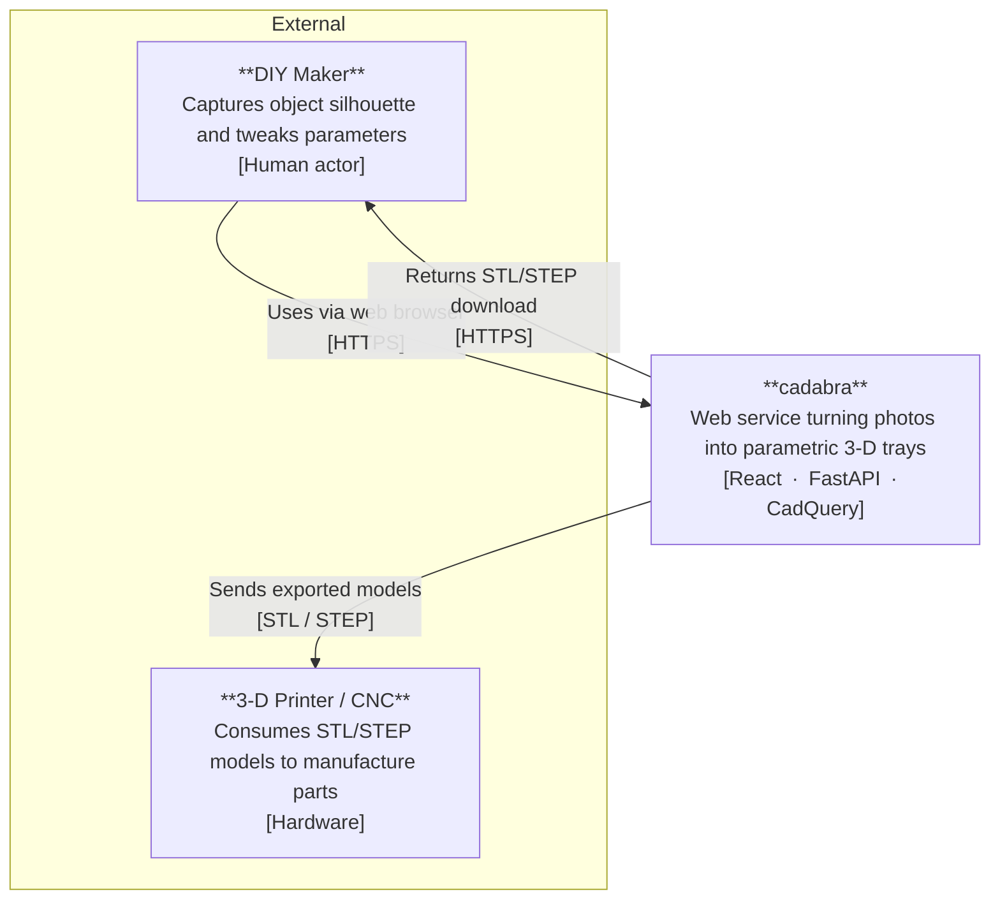
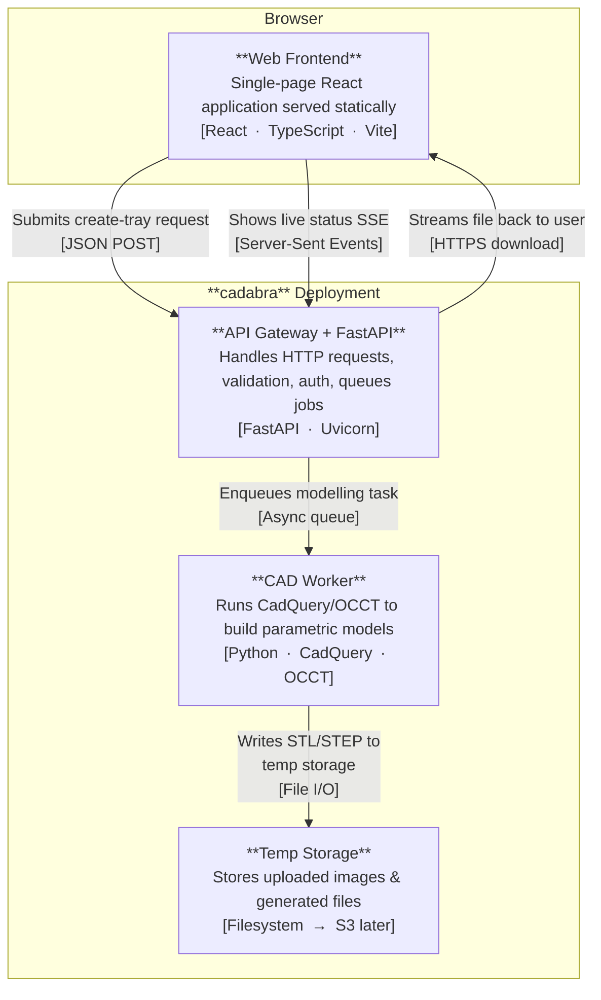
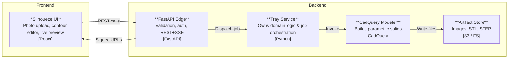
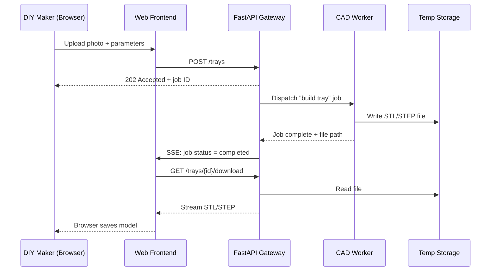
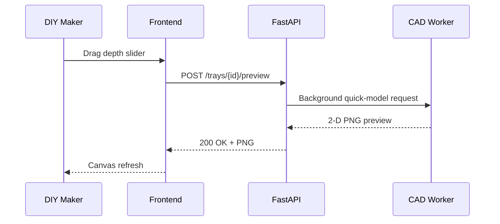

# System Patterns

> How the pieces fit together, why we chose them, and how they talk to each other.

This document outlines the system architecture for the application described in the [`projectbrief.md`](./projectbrief.md).

---

## 1 · System Architecture (C4)

### C4 Level 1 – System Context

### C4 Level 2 – Container Diagram

> **Notation**
> *Nodes*: `**Bold title** tweet-length description [tech footer]`
> *Edges*: `Action description [tech footer]`

---

## 2 · Key Technical Decisions

| Area                 | Decision                                                           | Rationale                                                        |
| -------------------- | ------------------------------------------------------------------ | ---------------------------------------------------------------- |
| **Server-side CAD**  | CadQuery 2 + OCCT in a worker container                            | Keeps browser light; leverages parametric solids.                |
| **Job Dispatch**     | FastAPI background task for MVP; pluggable queue later (Celery/RQ) | Simplicity first, upgrade path ready.                            |
| **File Storage**     | Ephemeral disk → S3-compatible bucket                              | Works locally, scales to cloud.                                  |
| **Dependency Mgmt**  | `pixi` for Python, `pnpm` for Node                                 | Reproducible, fast, lock-file-based workflows.                   |
| **Containerisation** | Multi-stage Docker using `mambaorg/pixi` base                      | Tiny runtime image (< 200 MB) while retaining compiled CAD libs. |
| **Auth**             | Anonymous download for MVP, signed URLs; JWT planned               | Remove barriers to first-use, phased security.                   |

---

## 3 · Design Patterns in Use

* **Client-Server + Async Worker** – keeps UI snappy while heavy CAD runs off-thread.
* **CQRS-lite** – read path (download) separated from write path (create job).
* **Pipes & Filters** – photo → contour → model pipeline; each filter is replaceable.
* **Hexagonal / Ports-and-Adapters** – storage and queue are accessed through adapters, easing future vendor swaps.
* **Twelve-Factor Config** – all secrets & tuning via env-vars; zero hard-coded paths.

---

## 4 · Component Relationships (logical view)

---

## 5 · Core Sequence Diagrams

### 5.1 Generate Tray Workflow

### 5.2 Live Preview Parameter Tweak

